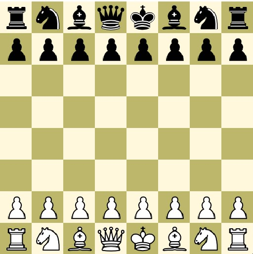
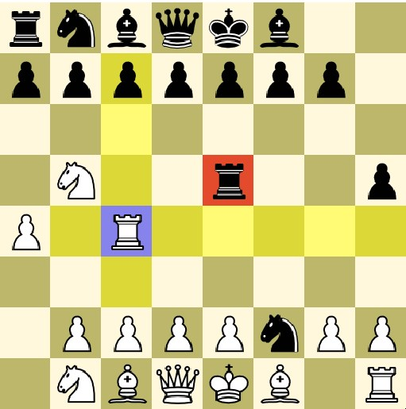
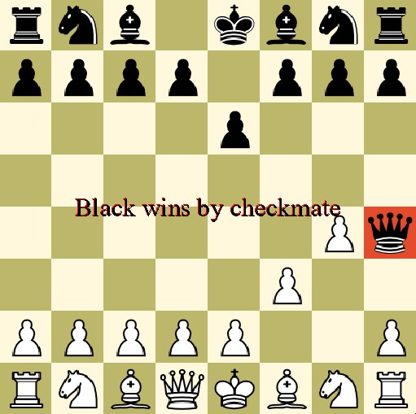

# Python-Chess-Game
Implementation of a 2 player Chess game using pygame. 

Features include:

Movement Animations

Highlighting possible moves (and last move played)

Includes Enpassant and Castling (currently pawn promotion is strictly queen)

Pieces protecting the king from check can't be moved

Press 'r' to reset board

Press 'z' to undo last move(s) 

**Screenshots**

